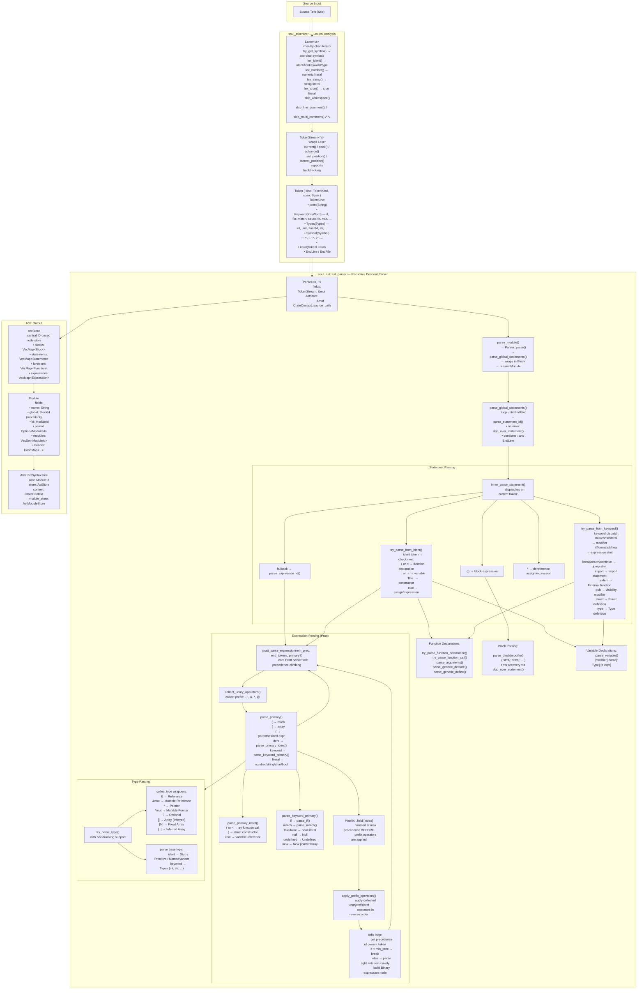

# Parser Flow Diagram

```mermaid
flowchart TB
    subgraph Input["Source Input"]
        Source["Source Text (&amp;str)"]
    end

    subgraph Tokenizer["soul_tokenizer — Lexical Analysis"]
        Lexer["Lexer&lt;'a&gt;
            char-by-char iterator
            try_get_symbol() → two-char symbols
            lex_ident() → identifier/keyword/type
            lex_number() → numeric literal
            lex_string() → string literal
            lex_char() → char literal
            skip_whitespace()
            skip_line_comment() // 
            skip_multi_comment() /* */"]

        TokenStream["TokenStream&lt;'a&gt;
            wraps Lexer
            current() / peek() / advance()
            set_position() / current_position()
            supports backtracking"]

        TokenModel["Token { kind: TokenKind, span: Span }
            TokenKind:
            • Ident(String)
            • Keyword(KeyWord) — if, for, match, struct, fn, mut, ...
            • Types(Types) — int, uint, float64, str, ...
            • Symbol(Symbol) — +, -, ->, :=, ...
            • Literal(TokenLiteral)
            • EndLine / EndFile"]
    end

    subgraph ParserCore["soul_ast::ast_parser — Recursive Descent Parser"]
        Parser["Parser&lt;'a, 'f&gt;
            fields: TokenStream, &amp;mut AstStore,
                    &amp;mut CrateContext, source_path"]

        ParseEntry["parse_module()
            → Parser::parse()
            → parse_global_statements()
            → wraps in Block → returns Module"]

        GlobalStmtLoop["parse_global_statements()
            loop until EndFile:
            • parse_statement_id()
            • on error: skip_over_statement()
            • consume ; and EndLine"]

        subgraph StatementParsing["Statement Parsing"]
            InnerStmt["inner_parse_statement()
                dispatches on current token:"]

            FromIdent["try_parse_from_ident()
                ident token → check next:
                ( or &lt; → function declaration
                : or := → variable
                This. → constructor
                else → assign/expression"]

            FromKeyword["try_parse_from_keyword()
                keyword dispatch:
                mut/const/literal → modifier
                if/for/match/new → expression stmt
                break/return/continue → jump stmt
                import → Import statement
                extern → External function
                pub → visibility modifier
                struct → Struct definition
                type → Type definition"]

            FromBlock["{ } → block expression"]
            FromStar["* → dereference assign/expression"]
            FromExpr["fallback → parse_expression_id()"]
        end

        subgraph ExpressionParsing["Expression Parsing (Pratt)"]
            Pratt["pratt_parse_expression(min_prec, end_tokens, primary?)
                core Pratt parser with precedence climbing"]

            CollectUnary["collect_unary_operators()
                collect prefix: -, !, &amp;, *, @"]

            ParsePrimary["parse_primary()
                { → block
                [ → array
                ( → parenthesized expr
                ident → parse_primary_ident()
                keyword → parse_keyword_primary()
                literal → number/string/char/bool"]

            PrimaryIdent["parse_primary_ident()
                ( or &lt; → try function call
                { → struct constructor
                else → variable reference"]

            KeywordPrimary["parse_keyword_primary()
                if → parse_if()
                match → parse_match()
                true/false → bool literal
                null → Null
                undefined → Undefined
                new → New pointer/array"]

            PostfixLoop["Postfix: .field [index]
                handled at max precedence BEFORE
                prefix operators are applied"]

            InfixLoop["Infix loop:
                get precedence of current token
                if &lt; min_prec → break
                else → parse right side recursively
                build Binary expression node"]

            ApplyPrefix["apply_prefix_operators()
                apply collected unary/ref/deref
                operators in reverse order"]
        end

        subgraph TypeParsing["Type Parsing"]
            ParseType["try_parse_type()
                with backtracking support"]

            TypeWrappers["collect type wrappers:
                &amp; → Reference
                &amp;mut → Mutable Reference
                * → Pointer
                *mut → Mutable Pointer
                ? → Optional
                [] → Array (inferred)
                [N] → Fixed Array
                [_] → Inferred Array"]

            TypeBase["parse base type:
                ident → Stub / Primitive / NamedVariant
                keyword → Types (int, str, ...)"]
        end

        Functions["Function Declarations:
            try_parse_function_declaration()
            try_parse_function_call()
            parse_arguments()
            parse_generic_declare()
            parse_generic_define()"]

        Blocks["Block Parsing:
            parse_block(modifier)
            { stmt₁; stmt₂; ... }
            error recovery via skip_over_statement()"]

        Variables["Variable Declarations:
            parse_variable()
            [modifier] name[: Type] [= expr]"]
    end

    subgraph Output["AST Output"]
        Module["Module
            fields:
            • name: String
            • global: BlockId (root block)
            • id: ModuleId
            • parent: Option&lt;ModuleId&gt;
            • modules: VecSet&lt;ModuleId&gt;
            • header: HashMap&lt;...&gt;"]

        AstStore["AstStore
            central ID-based node store
            • blocks: VecMap&lt;Block&gt;
            • statements: VecMap&lt;Statement&gt;
            • functions: VecMap&lt;Function&gt;
            • expressions: VecMap&lt;Expression&gt;"]

        AST["AbstractSyntaxTree
            root: ModuleId
            store: AstStore
            context: CrateContext
            module_store: AstModuleStore"]
    end

    Source --> Lexer
    Lexer --> TokenStream
    TokenStream --> TokenModel
    TokenModel --> Parser

    Parser --> ParseEntry
    ParseEntry --> GlobalStmtLoop
    GlobalStmtLoop --> InnerStmt

    InnerStmt --> FromIdent
    InnerStmt --> FromKeyword
    InnerStmt --> FromBlock
    InnerStmt --> FromStar
    InnerStmt --> FromExpr

    FromExpr --> Pratt
    FromBlock --> Blocks
    FromIdent --> Functions
    FromIdent --> Variables
    FromIdent --> Pratt
    FromKeyword --> Functions
    FromKeyword --> Variables

    Pratt --> CollectUnary
    CollectUnary --> ParsePrimary
    ParsePrimary --> PrimaryIdent
    ParsePrimary --> KeywordPrimary
    ParsePrimary --> TypeParsing
    ParsePrimary --> Pratt
    ParsePrimary --> PostfixLoop
    PostfixLoop --> ApplyPrefix
    ApplyPrefix --> InfixLoop
    InfixLoop --> Pratt

    ParseType --> TypeWrappers
    ParseType --> TypeBase

    Parser --> AstStore
    AstStore --> Module
    Module --> AST
```
